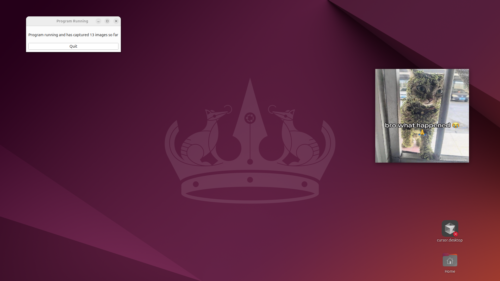

# Desktop embedded image dataset generator

# Goal of program: 

To create a dataset of images embedded in a desktop environment, for AI training downstream.

---------------------------------------------------------------------------------------------

# Why:

I am training a real time image detection system for desktops and to make it work well the data needs to spread out and in sometimes unlikely locations if the AI system is going to be robust to outliers. This program will help generate many different usable training images where the the "sub images" of interest are randomly placed on the desktop in a variety of locations. Ideally this will lead to the AI system being able to detect images everywhere.

---------------------------------------------------------------------------------------------

# How it works:

What it does at a high level is take the images you put in the image folder, and at a frequency of your choice will display an image on the screen every x seconds. It will then take a screenshot of the image, and close the display so the image dissapears. This works for multiple monitors (I tested with two) and there is a minimalist GUI for setting the image appearing frequency and closing the program. See the example image above where the embedded image is a cat covered in vines.

The screenshotted images will be saved in a folder that is created with todays date and a filename that corresponds to the time the picture was taken and what monitor the picture was from.

On startup there is a inital placeholder image displayed, it is not screen-shotted, you can change it change it by putting your own starter.png in the directory.

--------------------------------------------------------------------------------------------

How to run the program:
1. Save the repo into a folder of your choice
2. Install anaconda from [anaconda.com](https://www.anaconda.com/) for python environment control
3. Open up anaconda prompt and run 'conda create -n "DesktopDataset" python=3.11'
4. Run 'conda activate DesktopDataset'
5. Install requirements.txt by changing directories into the the folder you saved this project at and running 'pip install -r requirements.txt' in the anaconda prompt
6. After the installation is complete, go to the images folder and put in all the images you want to create the dataset with.
7. Run 'python main.py' within the environment you created. The program should run correctly.

---------------------------------------------------------------------------------------------

On linux if you get this error:
qt.qpa.plugin: From 6.5.0, xcb-cursor0 or libxcb-cursor0 is needed to load the Qt xcb platform plugin.

what I did was install xcb-cursor0 with: sudo apt-get install libxcb-cursor0
And the program worked
